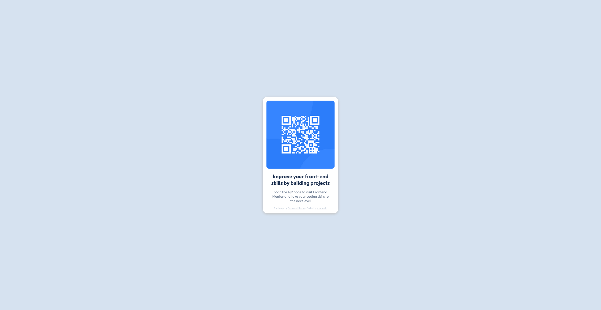

# Frontend Mentor - QR code component solution

This is a solution to the [QR code component challenge on Frontend Mentor](https://www.frontendmentor.io/challenges/qr-code-component-iux_sIO_H). Frontend Mentor challenges help you improve your coding skills by building realistic projects. 

## Table of contents

- [Overview](#overview)
  - [Screenshot](#screenshot)
  - [Links](#links)
- [My process](#my-process)
  - [Built with](#built-with)
  - [What I learned](#what-i-learned)
  - [Continued development](#continued-development)
  - [Useful resources](#useful-resources)
- [Author](#author)

## Overview

I started my programming journey just 5 days ago, with the burning desire to learn something new that I've been interested in for a long time. I delved into programming when I was younger, looking at JavaScript code and trying to piece it together to make a Minecraft Pocket Edition mod. I remember the feeling of utter joy and excitement I felt when something I (partly) came up with really worked. I want to create stuff. I want this to be my career. I want to experience these feelings again and create things that people want to use and that really help them out. Currently, I'm studying Management & Entrepreneurship, but I just feel that this isn't it 100%. I don't want to be a manager. I want to be a creator and founder. Developing ideas and sprouting them to life. Frontend Mentor is an amazing resource I found for that. I am grateful for this opportunity and am looking forward to the challenges ahead. This is the first challenge I've completed, and I am really proud.

### Screenshot



### Links

- [Solution URL](https://github.com/sascha-lr/frontend-challenge-qr)
- [Live Site URL](https://sascha-lr.github.io/frontend-challenge-qr/)

## My process

I first started reading the challenge and the style guide and then just went straight into programming the basic elements in HTML, after which I designed them in CSS. I utilized all of the techniques (and more) I have learned thus far and think that I did a good job considering I only completed the first part of the Full-Stack Developer Career Path on [Mimo](https://mimo.org/).

### Built with

- Semantic HTML5 markup
- CSS custom properties (HSL colors, etc.)
- Flexbox for layout
- Mobile-first workflow

### What I learned

Prior to this, I haven't even learned what a div ```<div>```is, but because of looking at the code and thinking about what I know about web design from previously using resources like [Framer](https://framer.com), I quickly figured it out. It was an amazing learning experience. I also learned how to center things on a page vertically, what kind of different units there are to specify measurements ```px```,```%```,```vh```,```rem```, etc. For that, I am really happy.

### Continued development

I want to really focus on and be proficient at making my code well-written, understandable and responsive. I will dedicate a lot of time to learn how to be a better programmer and am looking forward to this journey!

### Useful resources

- [Mimo](https://mimo.org/) - I really like this resourcee so far, because I can get bite-sized coding lessons anywhere I am. It is amazing for my development and learning.
- [freeCodeCamp](https://www.freecodecamp.org) - This is an amazing resource, which I use simultaneously, as a more serious course comnpared to Mimo, to learn Full-Stack Web Development.
- [W3Schools](https://www.w3schools.com/cssref/css3_pr_box-shadow.php) - From W3Schools, specifically this article on how to make a box shadow. I learned and gathered information on how to execute certain ideas. Another amazing resource.

## Author

- GitHub - [sascha-lr](https://github.com/sascha-lr)
- Frontend Mentor - [@sascha-lr](https://www.frontendmentor.io/profile/sascha-lr)
